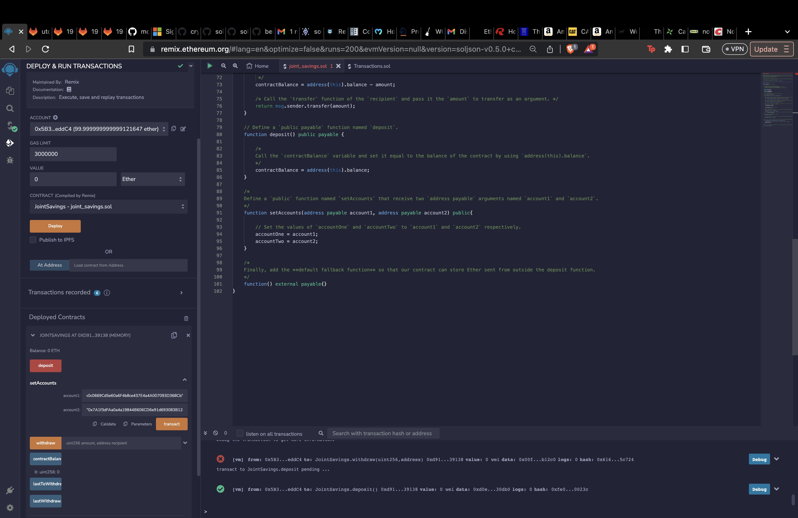
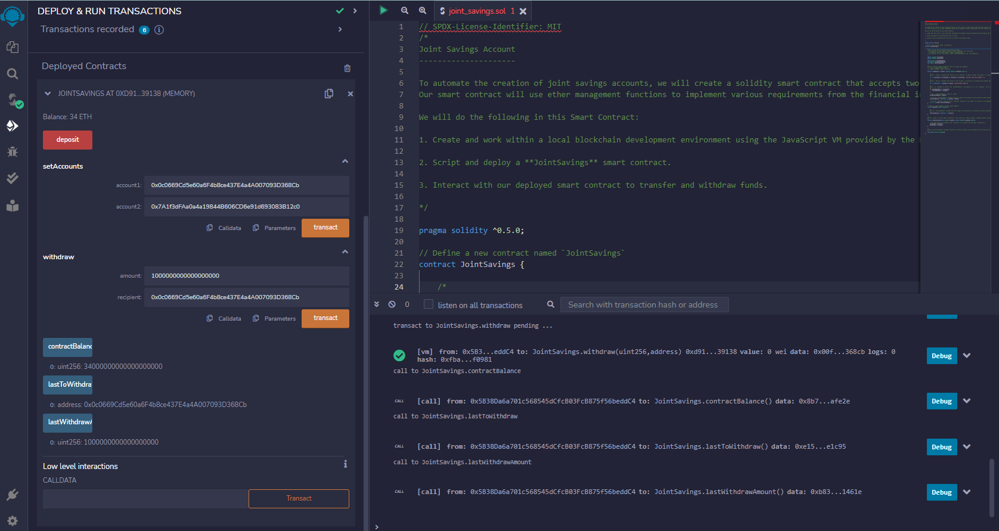
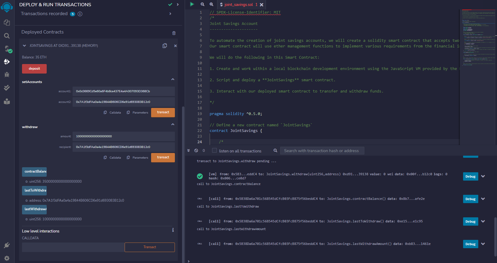
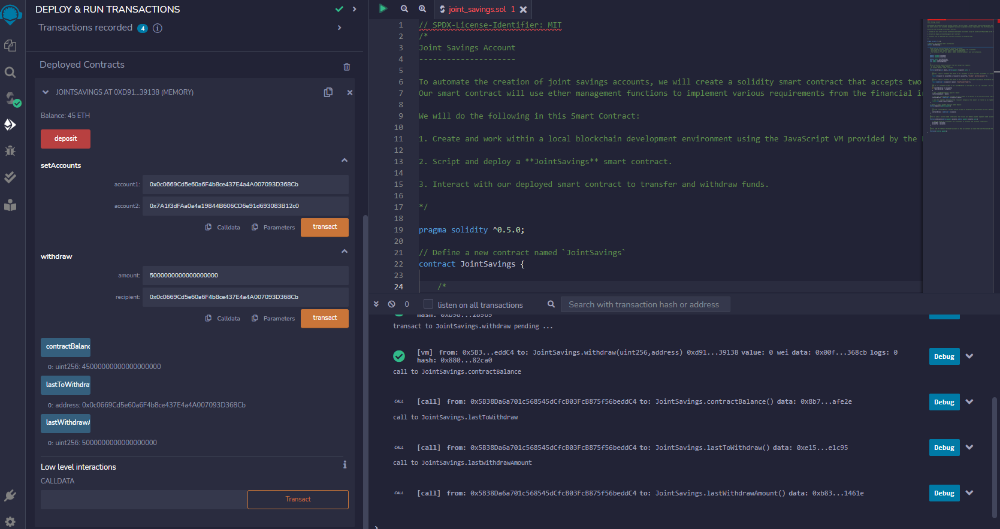
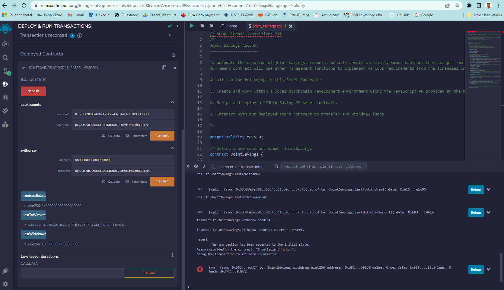
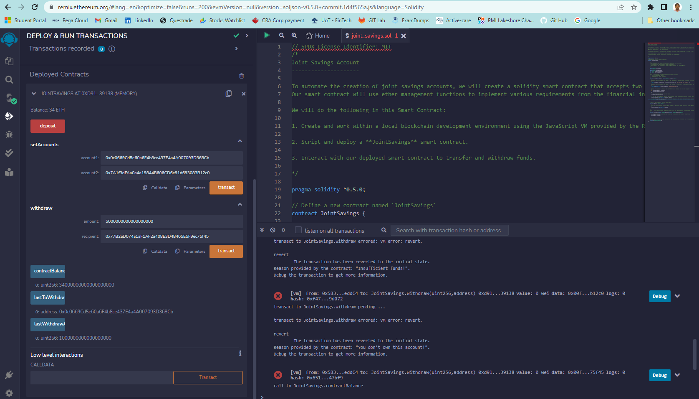

# solidity_smart_contract

The aim of this repository is for building smart contracts to automate many of the institutions’ financial processes and features, such as hosting joint savings accounts.
 
Here we are automating the creation of joint savings accounts. We will create a solidity smart contract that accepts two user addresses that are then able to control a joint savings account. 

Our smart contract will use ether management functions to implement various requirements from the financial institution to provide the features of the joint savings account.

We will do the following in this Smart Contract:

1. Create and work within a local blockchain development environment using the JavaScript VM provided by the Remix IDE.

2. Script and deploy a **JointSavings** smart contract.

3. Interact with our deployed smart contract to transfer and withdraw funds.

 

## Set up for test run

Using the `setAccounts` function to define the authorized Ethereum address that will be able to withdraw funds from our contract. 

We used the following Ethereum addresses:

    Dummy account1 address: 0x0c0669Cd5e60a6F4b8ce437E4a4A007093D368Cb
    Dummy account2 address: 0x7A1f3dFAa0a4a19844B606CD6e91d693083B12c0

 

## Transacations

After successfully depositing 50 ether as initial funds into our contract, to test the contract’s withdrawal functionality we perfromed 3 transactions by withdrawing:

    Transaction 1: Send 1 ether as wei.
    Transaction 2: Send 10 ether as wei.
    Transaction 3: Send 5 ether.
After each transaction, use the `contractBalance` function to verify that the funds were withdrawn from our contract. Also, use the `lastToWithdraw` and `lastWithdrawAmount` functions to verify that the address and amount were correct.

 

* Transaction 1: 1 ether into `accountOne`: 0x0c0669Cd5e60a6F4b8ce437E4a4A007093D368Cb  

* Transaction 2: 10 ether into `accountTwo`: 0x7A1f3dFAa0a4a19844B606CD6e91d693083B12c0

* Transaction 3: 5 ether into `accountOne`: 0x0c0669Cd5e60a6F4b8ce437E4a4A007093D368Cb

 

## Error Handling

* Check if the `balance` is sufficient to accomplish the withdraw operation. If there are insufficient funds, the text `Insufficient funds!` is returned.

* Checks if the `recipient` is equal to either `accountOne` or `accountTwo`. The `require` statement returns the text `"You don't own this account!"` if it does not.

